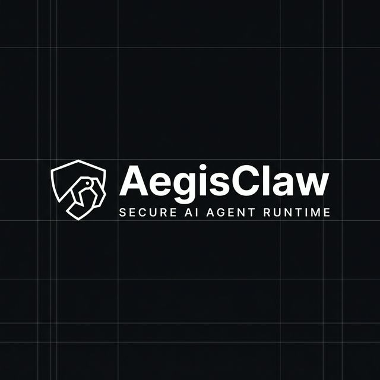

# AegisClaw - Secure Agent Runtime



AegisClaw is a **secure-by-default runtime** and security envelope for OpenClaw-style personal AI agents.


> **Goal:** Make "agentic automation" safe enough for individuals by default, and scalable enough for teams.

AegisClaw acts as a security envelope around your AI agents, providing sandboxing, granular permissions, and human-in-the-loop approvals.

---

## 🚀 Key Features

- **🐳 Hardened Sandbox**: Executes agent skills in a restricted Docker container (non-root, read-only rootfs, dropped capabilities, seccomp).
- **🛡️ Granular Scopes**: Permission model (e.g., `files.read:/home/user/docs`, `shell.exec`, `net.outbound:github.com`).
- **✋ Human-in-the-Loop**: TUI-based approval system for high-risk actions.
- **🔐 Secret Encryption**: `age`-based encryption for sensitive API keys.
- **📜 Audit Logging**: Tamper-evident, hash-chained logs of all agent actions.

## 📦 Installation

### From Source

```bash
# Clone the repository
git clone https://github.com/mackeh/AegisClaw.git
cd AegisClaw

# Build the binary
go build -o aegisclaw ./cmd/aegisclaw

# Verify installation
./aegisclaw --version
```

## ⚡ Quick Start

### 1. Initialize

Create the default configuration structure in `~/.aegisclaw`:

```bash
./aegisclaw init
```

### 2. Configure Secrets

Initialize the encryption keys and set a secret:

```bash
./aegisclaw secrets init
./aegisclaw secrets set OPENAI_API_KEY sk-proj-12345
```

### 3. Run a Sandboxed Command

Test the hardened runtime using a Docker image:

```bash
# This runs 'echo' inside the sandbox
./aegisclaw sandbox run-sandbox alpine:latest echo "Hello Safe World"
```

### 4. View Audit Logs

Check the immutable log of actions:

```bash
./aegisclaw logs
./aegisclaw logs verify  # Check cryptographic integrity
```

## 🔗 OpenClaw Integration

This section shows how to integrate OpenClaw agents with AegisClaw while preserving AegisClaw's security guarantees (sandboxing, scoped permissions, audit logging).

Prerequisites
- AegisClaw built and configured (see Quick Start)
- Docker installed and running
- OpenClaw agent or skill package (container image or source)

Steps

1) Store OpenClaw credentials in AegisClaw secrets

```bash
# Store the OpenClaw API key (example)
./aegisclaw secrets set OPENCLAW_API_KEY sk-openclaw-xxxxx
```

2) Enable/configure the OpenClaw adapter

AegisClaw includes an OpenClaw adapter that mediates communication between agents and external services. Enable it by creating an adapter config at `~/.aegisclaw/adapters/openclaw.yaml`:

```yaml
enabled: true
endpoint: "http://localhost:8080" # or the OpenClaw service URL
api_key_secret: "OPENCLAW_API_KEY" # name in aegisclaw secrets
timeout_ms: 5000
```

3) Register your OpenClaw-based skill/agent (manifest)

Create a skill manifest that AegisClaw can run in the sandbox. Example `skills/web-search.yaml`:

```yaml
name: web-search
image: ghcr.io/openclaw/web-search:latest
platform: docker
scopes:
  - net.outbound:api.openclaw.example.com
  - files.read:/tmp/allowed
signature: "ed25519:..." # optional signed skill verification
```

Register the skill with AegisClaw (if you keep skills in a local registry or the config directory):

```bash
# copy manifest into the skills directory used by AegisClaw
mkdir -p ~/.aegisclaw/skills
cp skills/web-search.yaml ~/.aegisclaw/skills/
```

4) Run the skill with AegisClaw's hardened runtime

```bash
# Run a registered skill inside the sandbox (example)
./aegisclaw sandbox run-registered web-search
```

If your deployment runs an external OpenClaw service (instead of containerized skills), ensure AegisClaw's adapter will only allow the necessary egress and that API keys are provided via the secret name in the adapter config. All adapter actions are recorded in AegisClaw's audit log.

Security & Policies
- Use least-privilege scopes for skills (e.g., `files.read:/specific/path` rather than `files.read:/`).
- Require skill signing and verify signatures for production skills.
- Use the TUI approval flow for any skill that requests high-risk scopes.

Troubleshooting
- If a skill cannot reach the OpenClaw endpoint, check the egress proxy/egress rules and the adapter `endpoint` setting.
- Verify secrets are present: `./aegisclaw secrets list`
- Inspect audit logs for denied actions: `./aegisclaw logs`

## 🗺️ Roadmap

### Completed

- [x] **v0.1.0-0.1.7 (Foundations)**: CLI, Policy Engine, TUI Approval, Hardened Docker, `age` Secrets, Audit Logging, OpenClaw Adapter.
- [x] **v0.1.8 (Egress Control)**: Integrated egress filtering proxy with audit trails.
- [x] **v0.1.9 (Signed Skills)**: Ed25519 signature verification and registry search/add.

### Upcoming (v0.2+)

- [x] **Policy Engine**: OPA (Rego) policy engine integration.
- [ ] **Advanced Runtimes**: `docker-compose` support for easy multi-container setups. support for gVisor (added `sandbox_runtime` config), Kata Containers, or Nix/bubblewrap for advanced users.
- [ ] **Safety Layer**: NeMo Guardrails integration for LLM prompt protection and custom execution rails.
- [ ] **Secret Brokering**: `sops` integration; pluggable support for HashiCorp Vault, Infisical, and Bitwarden.
- [ ] **Auth & Privacy**: Tailscale/WireGuard integration for private access; Authelia/Keycloak for web UI identity.
- [ ] **Observability**: OpenTelemetry instrumentation and simple dashboards (Prometheus/Grafana).
- [ ] **Skills Ecosystem**: Git-based skill distribution with enhanced hash-chained provenance.

## 🤝 Contributing

We welcome contributions! Please see our [CONTRIBUTING.md](CONTRIBUTING.md) for details on how to get started.

- [Bug Report](.github/ISSUE_TEMPLATE/bug_report.md)
- [Feature Request](.github/ISSUE_TEMPLATE/feature_request.md)

## 📜 License

Apache 2.0 - See [LICENSE](LICENSE) for details.

---

**Repository Topics:** `security`, `agent-runtime`, `sandbox`, `golang`, `ai-safety`, `docker`, `seccomp`