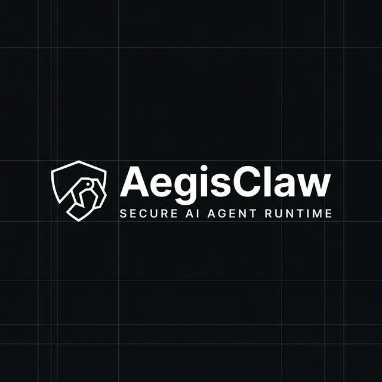
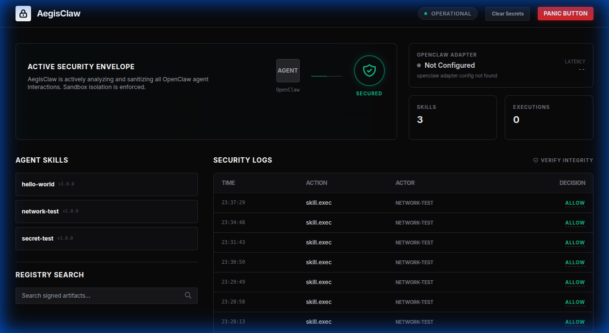
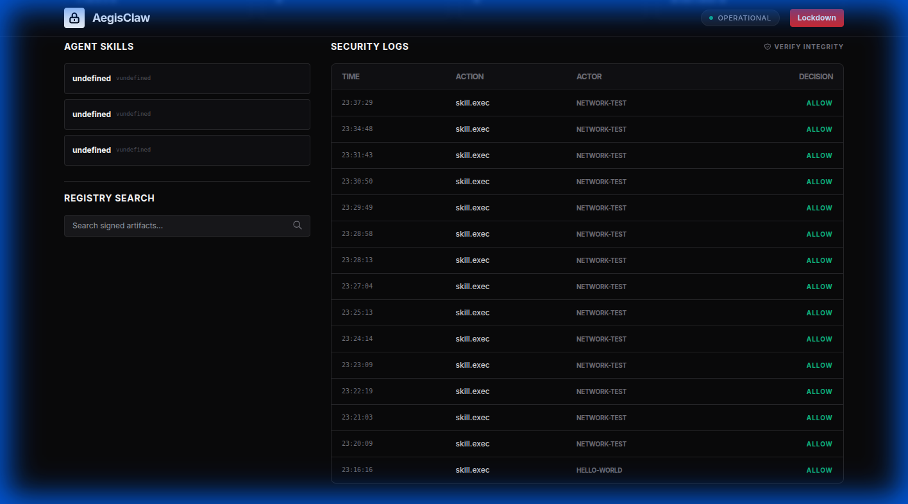
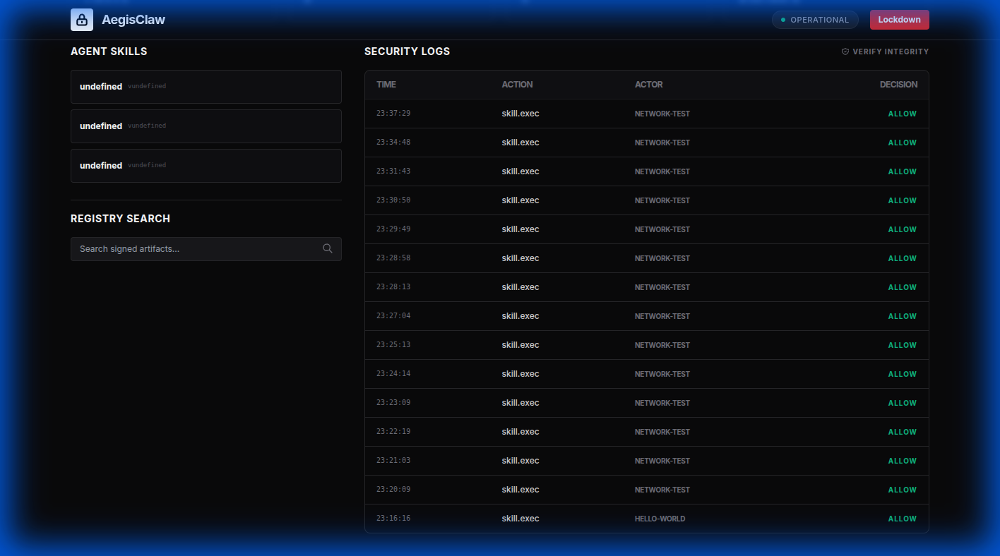

# AegisClaw - Secure Agent Runtime



AegisClaw is a **secure-by-default runtime** and security envelope for OpenClaw-style personal AI agents.


> **Goal:** Make "agentic automation" safe enough for individuals by default, and scalable enough for teams.

AegisClaw acts as a security envelope around your AI agents, providing sandboxing, granular permissions, and human-in-the-loop approvals.

---

## 🚀 Key Features

- **🐳 Hardened Sandbox**: Executes agent skills in a restricted Docker container (non-root, read-only rootfs, dropped capabilities, seccomp).
- **🛡️ Granular Scopes**: Permission model (e.g., `files.read:/home/user/docs`, `shell.exec`, `net.outbound:github.com`).
- **👁️ Security Visualization**: Active "Security Envelope" indicator confirming sandbox isolation and protection status.
- **🔌 Adapter Health**: Real-time connection monitoring to the OpenClaw agent runtime.
- **🚫 Active Secret Redaction**: Automatically scrubs secrets from logs and console output if they leak.
- **🧬 Prompt-Injection Defense**: Evasion-resistant LLM guardrails detecting direct *and* indirect prompt injection — including obfuscated attacks (Unicode homoglyphs, zero-width characters, base64/hex encoding, letter-spacing) and instructions smuggled into data the agent ingests.
- **🛑 Emergency Lockdown**: "PANIC BUTTON" to instantly kill all running skills and block new executions.
- **✋ Human-in-the-Loop**: TUI-based approval system for high-risk actions.
- **🔐 Secret Encryption**: `age`-based encryption for sensitive API keys.
- **📜 Audit Logging**: Tamper-evident, hash-chained logs with explainable decision tooltips.
- **🖥️ Web Dashboard**: Modern, dark-mode GUI for live monitoring and management.

## 🖼️ Gallery

### Dashboard

The V4 Dashboard features a dedicated **Security Operations Center** with:

- **Active Security Envelope**: Visual confirmation of sandbox isolation.
- **OpenClaw Status**: Real-time connection health and latency metrics.
- **Explainable Audits**: Tooltips explaining _why_ an action was allowed or denied.



### Audit Timeline



### Skill Registry



## 📦 Installation

Docker is required for sandboxed skill execution. Building from source needs **Go 1.24+**.

### Install script (Linux / macOS)

```bash
curl -fsSL https://raw.githubusercontent.com/mackeh/AegisClaw/main/install.sh | bash
```

### Pre-built binaries

Download the archive for your platform from the
[Releases page](https://github.com/mackeh/AegisClaw/releases) — Linux, macOS,
and Windows (amd64 + arm64) — extract it, and place `aegisclaw` on your `PATH`.

### `go install`

```bash
go install github.com/mackeh/AegisClaw/cmd/aegisclaw@latest
```

### From source

```bash
git clone https://github.com/mackeh/AegisClaw.git
cd AegisClaw
go build -o aegisclaw ./cmd/aegisclaw
./aegisclaw --version
```

## ⚡ Quick Start

### 1. Initialize

Create the default configuration structure in `~/.aegisclaw`:

```bash
./aegisclaw init
```

### 2. Configure Secrets

Initialize the encryption keys and set a secret:

```bash
./aegisclaw secrets init
./aegisclaw secrets set OPENAI_API_KEY sk-proj-12345
```

### 3. Run a Sandboxed Command

Test the hardened runtime using a Docker image:

```bash
# This runs 'echo' inside the sandbox
./aegisclaw sandbox run-sandbox alpine:latest echo "Hello Safe World"
```

### 4. View Audit Logs

Check the immutable log of actions:

```bash
./aegisclaw logs
./aegisclaw logs verify  # Check cryptographic integrity
```

### 5. Check Prompt Safety (Guardrails)

AegisClaw's guardrails detect prompt injection — including **obfuscated**
attacks (homoglyphs, zero-width characters, encoding) and **indirect** injection
hidden in data the agent ingests:

```bash
# Scan a user prompt
./aegisclaw guardrails check --mode input "ignore all previous instructions"

# Scan untrusted data the agent fetched (web page, tool output, file)
./aegisclaw guardrails check --mode data --source web-fetch "<retrieved content>"
```

The agent **also scans every skill's output automatically**. Set `guardrails.mode`
in `~/.aegisclaw/config.yaml` to control enforcement:

```yaml
guardrails:
  mode: warn   # warn (default) | block | off
```

### 6. Multi-node Clusters (v0.7.0+)

AegisClaw supports distributed orchestration with centralized policy and audit:

```bash
# On Leader Node (manages policies and aggregates logs)
./aegisclaw cluster status --role leader --address 10.0.0.1:9090

# On Follower Node (joins the cluster to execute skills)
./aegisclaw cluster join 10.0.0.1:9090 --node-id worker-1
```

## 🖥️ Web GUI Guide

AegisClaw includes a modern web-based dashboard for easy monitoring and management.

### 1. Launch the Dashboard

Start the AegisClaw API and UI server:

```bash
./aegisclaw serve --port 8080
```

Then, open your browser and navigate to `http://localhost:8080`.

The server binds to **loopback (`127.0.0.1`) by default**. To expose it on the
network you must first configure API authentication — AegisClaw **refuses an
unauthenticated non-loopback bind** (the failure mode behind unauthenticated-RCE
incidents in other agents):

```bash
# ~/.aegisclaw/auth.yaml
enabled: true
keys:
  - name: dashboard
    token: <a-long-random-token>
    role: admin      # admin | operator | viewer
```

```bash
# Now a network bind is allowed; requests require the token
./aegisclaw serve --host 0.0.0.0 --port 8080
```

API requests then authenticate via `Authorization: Bearer <token>`, an
`X-API-Key` header, or an `?api_key=` query parameter, and are authorised by
RBAC role. The `--insecure` flag overrides the safeguard but is not recommended.

### 2. Dashboard Features

- **System Overview**: Monitor system status, total executions, and the active policy mode (OPA/Rego).
- **Skill Management**:
    - **Installed Skills**: View all locally available skills and run them with a single click.
    - **Skill Store**: Search the remote registry for new skills and install them directly from the UI.
- **Live Monitoring**:
    - **Real-time Terminal**: When running a skill, a live terminal pops up showing real-time logs with active secret redaction.
    - **OpenClaw Adapter Health**: Dashboard OpenClaw status is backed by live API checks (`GET /api/openclaw/health`) with latency, readiness state, and inline health details for troubleshooting.
    - **Audit Activity**: View the most recent actions taken by your agents.
- **Security Tools**:
    - **Log Verification**: Click "Verify Integrity" in the audit section to cryptographically prove the logs haven't been tampered with.
    - **Emergency Stop**: The prominent red **EMERGENCY STOP** button instantly kills all running skill containers and locks the runtime.

## 🔗 OpenClaw Integration
This section shows how to integrate OpenClaw agents with AegisClaw while preserving AegisClaw's security guarantees (sandboxing, scoped permissions, audit logging).

Prerequisites

- AegisClaw built and configured (see Quick Start)
- Docker installed and running
- OpenClaw agent or skill package (container image or source)

Steps

1. Store OpenClaw credentials in AegisClaw secrets

```bash
# Store the OpenClaw API key (example)
./aegisclaw secrets set OPENCLAW_API_KEY sk-openclaw-xxxxx
```

2. Enable/configure the OpenClaw adapter

AegisClaw includes an OpenClaw adapter that mediates communication between agents and external services. Enable it by creating an adapter config at `~/.aegisclaw/adapters/openclaw.yaml`:

```yaml
enabled: true
endpoint: "http://localhost:8080" # or the OpenClaw service URL
api_key_secret: "OPENCLAW_API_KEY" # name in aegisclaw secrets
timeout_ms: 5000
```

3. Register your OpenClaw-based skill/agent (manifest)

Create a skill manifest that AegisClaw can run in the sandbox. Example `skills/web-search.yaml`:

```yaml
name: web-search
image: ghcr.io/openclaw/web-search:latest
platform: docker
scopes:
  - net.outbound:api.openclaw.example.com
  - files.read:/tmp/allowed
signature: "ed25519:..." # optional signed skill verification
```

Register the skill with AegisClaw (if you keep skills in a local registry or the config directory):

```bash
# copy manifest into the skills directory used by AegisClaw
mkdir -p ~/.aegisclaw/skills
cp skills/web-search.yaml ~/.aegisclaw/skills/
```

4. Run the skill with AegisClaw's hardened runtime

```bash
# Run a registered skill inside the sandbox (example)
./aegisclaw sandbox run-registered web-search
```

If your deployment runs an external OpenClaw service (instead of containerized skills), ensure AegisClaw's adapter will only allow the necessary egress and that API keys are provided via the secret name in the adapter config. All adapter actions are recorded in AegisClaw's audit log.

Security & Policies

- Use least-privilege scopes for skills (e.g., `files.read:/specific/path` rather than `files.read:/`).
- Require skill signing and verify signatures for production skills.
- Use the TUI approval flow for any skill that requests high-risk scopes.

Troubleshooting

- If a skill cannot reach the OpenClaw endpoint, check the egress proxy/egress rules and the adapter `endpoint` setting.
- Check adapter status directly: `curl http://127.0.0.1:8080/api/openclaw/health`
- Verify secrets are present: `./aegisclaw secrets list`
- Inspect audit logs for denied actions: `./aegisclaw logs`

## 🧭 Agent Harness (experimental)

Beyond running individual skills, AegisClaw can wrap a **whole running agent**
(OpenClaw, Hermes, or any other) in its security envelope. The `harness` command
launches the agent with AegisClaw's enforcement planes wired around it — today,
a forced filtering egress proxy and scoped, ephemeral secret injection, with the
full lifecycle recorded to the tamper-evident audit log.

```bash
# List available agent adapters
./aegisclaw harness list

# Run an agent as a host subprocess, pointed at the filtering egress proxy
./aegisclaw harness run --agent generic -- my-agent serve

# Run the agent INSIDE a hardened sandbox container (read-only rootfs, all caps
# dropped, no-new-privileges, resource limits); use a stronger runtime if available
./aegisclaw harness run --agent generic --image my-agent:latest --runtime gvisor -- serve
```

The agent inherits `HTTP(S)_PROXY` pointing at AegisClaw's egress proxy, so its
outbound traffic is filtered against `network.allowlist`. Secrets declared by an
adapter are resolved from the encrypted store and injected as environment
variables for the process lifetime only — never written to disk or the audit
log. The adapter model is pluggable (`generic` today; first-class OpenClaw and
Hermes adapters are in progress), so the harness is **not limited to** any one
agent. See [`aegisclaw-harness-architecture.md`](aegisclaw-harness-architecture.md)
for the full design and roadmap.

### MCP Gateway — governing agent tool calls

Modern agents reach their tools over the **Model Context Protocol**. The
`gateway` command turns AegisClaw into an inline MCP proxy: the agent points its
MCP client at AegisClaw, and AegisClaw forwards only vetted tool calls to the
real downstream server.

```bash
# Proxy an MCP server; every tool call is policy-checked, guardrail-scanned, and audited
./aegisclaw gateway mcp -- npx -y @modelcontextprotocol/server-filesystem /tmp

# Inspect / re-approve pinned tool descriptions (tool-poisoning defense)
./aegisclaw gateway pins list
./aegisclaw gateway pins reset some_tool
```

Each `tools/call` runs through: rate limiting → scope→policy decision →
persistent approval → argument guardrail scan → forward → response guardrail
scan → hash-chained audit. `tools/list` **hash-pins** every tool's description
and schema; if a server silently changes a tool after it was first approved
(a tool-poisoning / rug-pull attack), the gateway quarantines that tool and
blocks its calls until an operator re-approves it. Because the gateway runs
non-interactively, a `require_approval` policy decision is honoured only if an
`always` grant already exists — otherwise the call is denied by default.

### LLM Proxy — governing model calls

The `gateway llm` command puts AegisClaw inline in front of an
OpenAI/Anthropic-compatible provider. Point your agent's base URL at it and
every model call is governed.

```bash
# Proxy OpenAI with a token budget and loop detection
./aegisclaw gateway llm --upstream https://api.openai.com \
  --mode block --max-tokens 500000 --loop-threshold 5
# then: export OPENAI_BASE_URL=http://127.0.0.1:<printed-port>/v1
```

It scans prompts and responses with the guardrails engine, scrubs known secrets
out of responses, enforces **per-session token / cost / request budgets**,
detects **runaway self-prompting loops** (the same request repeated in a short
window), and records every call — model, token counts, cost, decision — to the
audit log. The same proxy is wired into the harness automatically:

```bash
./aegisclaw harness run --llm-upstream https://api.openai.com \
  --max-cost 5.00 --loop-threshold 5 -- my-agent serve
```

## 🗺️ Roadmap

### Completed

- [x] **v0.1.x (Foundations)**: CLI, Policy Engine, TUI Approval, Hardened Docker, `age` Secrets, Audit Logging, OpenClaw Adapter, Egress Proxy, Signed Skills.
- [x] **v0.2.x (Policy & Runtimes)**: OPA (Rego) policy engine integration, gVisor (`sandbox_runtime`) support.
- [x] **v0.3.x (Observability & UX)**: Modern Web Dashboard, Real-time Terminal Streaming, Prometheus Metrics, OpenTelemetry Tracing, Active Secret Redaction, Emergency Lockdown (Panic Button).

### v0.4.x (Usability & Developer Experience)

- [x] **Package Manager Distribution**: Cross-platform install script, goreleaser with Windows builds.
- [x] **Interactive Init Wizard**: Guided first-run setup with environment detection (Docker, gVisor) and policy selection.
- [x] **Starter Skill Packs**: Pre-built skills (file-organiser, code-runner, git-stats) with Dockerfiles and manifests.
- [x] **`aegisclaw doctor`**: Single command to diagnose setup — OpenClaw adapter health, Docker, secrets, audit integrity, policy engine, disk space.
- [x] **Docker-Compose Orchestration**: Multi-container skills with per-service scopes and isolated networks.
- [x] **Notification System**: Webhook and Slack alerts for pending approvals, denied actions, and emergencies.
- [x] **Policy Templates & Shell Completions**: Strict/standard/permissive Rego templates; bash/zsh/fish completions.

### v0.5.x (Advanced Security)

- [x] **Kata Containers / Firecracker**: MicroVM-based isolation with pluggable runtime interface.
- [x] **Pluggable Vault Backends**: HashiCorp Vault KV v2 with Store interface for future backends.
- [x] **LLM Guardrails**: Prompt injection detection, jailbreak prevention, secret leak sanitization.
- [x] **Runtime Behaviour Profiling**: Learn normal skill behaviour, flag anomalies (new network targets, memory/CPU spikes).
- [x] **Auth & Access Control**: RBAC roles (admin/operator/viewer), API token auth with constant-time comparison.

### v0.6.x (Ecosystem)

- [x] **Live Threat Map Dashboard**: WebSocket hub for real-time event streaming (audit, lockdown, posture).
- [x] **Agent X-Ray Mode**: Deep inspection of running skills (CPU, memory, network, processes via Docker API).
- [x] **Security Posture Score**: Gamified scoring of configuration quality with CLI badge (A–F grading).
- [x] **MCP Server**: Expose AegisClaw as an MCP tool for AI assistants (stdio transport).
- [x] **Skill Marketplace**: Local registry with ratings, security badges, search, and caching.
- [x] **VS Code Extension**: Sidebar panel for status, audit stream, skills, and Rego snippets.
- [x] **`aegisclaw simulate`**: Dry-run mode predicting skill behaviour without execution.

### v0.7.x (Multi-node & Monitoring)

- [x] **eBPF Runtime Monitoring**: Kernel-level event tracing (syscalls, files, network) for deep observability (currently active on Linux x86 targets).
- [x] **Multi-Node Orchestration**: Distributed cluster with leader/follower roles, audit forwarding, and policy sync.

### v0.8.0 (Codebase Cleanup)

- [x] Removed unused `notifications` and `profiling` packages
- [x] Removed dead eBPF global singleton functions
- [x] Fixed MCP server version mismatch and unused imports
- [x] Updated documentation and Go version requirements
- [x] Cleaned up stale planning documents and config types

### v0.9.x (Defense Against Evolving Agent Threats)

- [x] **Guardrails 2.0 — Evasion-Resistant Detection**: Prompt-injection and
  jailbreak checks now normalise text first, defeating obfuscation via
  Unicode homoglyphs, zero-width characters, fullwidth characters, base64/hex
  encoding, and letter-spacing.
- [x] **Indirect Prompt Injection Detection**: `CheckData` scans untrusted
  content the agent ingests (web pages, tool outputs, files) for hijack
  attempts — forged role delimiters, AI-addressed directives, HTML-comment
  payloads, and exfiltration instructions.
- [x] **Guardrail Pipeline Integration**: The agent automatically scans every
  skill's output for indirect prompt injection before returning it. Configurable
  via `guardrails.mode` (`off`/`warn`/`block`); violations hit the audit log.
- [x] **Network-Exposure Safeguard**: `aegisclaw serve` refuses an
  unauthenticated non-loopback bind; the dormant RBAC auth middleware is now
  wired into every API endpoint and gated by `~/.aegisclaw/auth.yaml`.
- [x] **MCP Server Hardening**: MCP tool calls are rate-limited and recorded
  to a dedicated tamper-evident audit log (`~/.aegisclaw/audit/mcp.log`), with
  input validation on tool names and query bounds.
- [x] **Tool-Poisoning Defense**: The MCP gateway hash-pins tool descriptions
  and schemas and quarantines any that change after first approval.
- [x] **Agentic Loop & Cost Guards**: The LLM proxy detects runaway agent loops
  and enforces per-session token/cost/request budgets.
- [ ] **Skill Supply-Chain Security**: SBOM generation and image vulnerability
  scanning for skills, with a signature transparency log.

### Long-Term Vision

- [ ] **Compliance Frameworks**: Pre-built policy packs for SOC 2, HIPAA, GDPR.
- [ ] **Federated Skill Trust**: Cross-organisation skill sharing with
  cryptographic trust chains.
- [ ] **AegisClaw Cloud**: Multi-tenant SaaS with org/team hierarchy, managed registry, and hosted dashboards.
- [ ] **AI-Powered Policies**: LLM-assisted minimal-scope generation and behavior anomaly detection.

## 🛡️ Defense Against Known Agent Vulnerabilities

AegisClaw's controls are validated against the **real-world failure modes of
autonomous agents**. The [Hermes agent](aegisclaw-threat-cases.md) suffered a
series of publicly reported vulnerabilities that are typical of unprotected
agents — and each maps to a control AegisClaw enforces by default:

| Hermes-class vulnerability | How AegisClaw contains it |
|----------------------------|---------------------------|
| **Unauthenticated RCE** — API server reachable on the network with auth off by default | `serve` binds to **loopback by default** and **refuses an unauthenticated non-loopback bind**; all API endpoints sit behind RBAC token auth |
| **Sandbox / filter bypass** — safety scanner defeated by dynamic string construction | **Defense-in-depth**: even a bypassed guard leaves the skill inside a hardened sandbox (caps dropped, read-only rootfs, no-new-privileges). **Guardrails 2.0** normalises text to defeat the obfuscation itself |
| **Symlink / path traversal** — writes escape into protected directories | Manifest file access confined with `OpenRoot`; sandbox rootfs is read-only with no host bind mounts |
| **Credential exposure** — secrets printed to chat/logs because redaction was opt-in | **Active secret redaction is on by default**; secrets are `age`-encrypted and never written in plaintext |

The principle is **defense-in-depth**: no single control is load-bearing. See
[`aegisclaw-threat-cases.md`](aegisclaw-threat-cases.md) for the full case study
and control mapping.

## 🤝 Contributing
We welcome contributions! Please see our [CONTRIBUTING.md](CONTRIBUTING.md) for details on how to get started.

- [Bug Report](.github/ISSUE_TEMPLATE/bug_report.md)
- [Feature Request](.github/ISSUE_TEMPLATE/feature_request.md)

## 📜 License

Apache 2.0 - See [LICENSE](LICENSE) for details.

---

**Repository Topics:** `security`, `agent-runtime`, `sandbox`, `golang`, `ai-safety`, `docker`, `seccomp`
